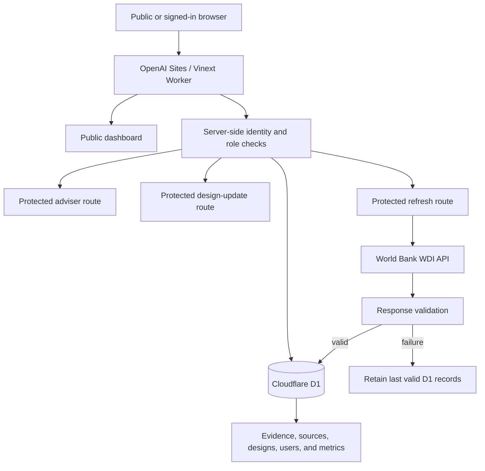

# Northstar Compute: University AI Datacenter Decision

A full-stack decision website for a Québec-led consortium of Canadian universities evaluating whether to build, lease, or phase its AI-compute infrastructure.

**Published website:** [university-ai-infrastructure-decision.olivialjy.chatgpt.site](https://university-ai-infrastructure-decision.olivialjy.chatgpt.site)

**GitHub repository:** [OliviaLJY/Design-Concept-for-an-AI-Datacenter](https://github.com/OliviaLJY/Design-Concept-for-an-AI-Datacenter)

## Decision Summary

The recommendation is a **phased hybrid**:

- Lease burst capacity immediately.
- Build a 10 MW IT-load facility in Québec only after the demand, grid, and construction-cost gates are satisfied.
- Defer the full 25 MW build until utilization and contractual demand justify expansion.

Approval requires:

1. Seven-year member commitments covering at least 70% of capacity.
2. A firm utility offer defining price, upgrade scope, curtailment, and energization date.
3. A fixed-price EPC bid with liquid-cooling performance guarantees.

This is an initial design concept, not a construction-ready engineering design, real-time grid-control system, professional certification, or financial investment recommendation.

## Users and Demand

The target users are a Québec-led consortium of Canadian universities and educational institutions.

| User segment | Planning share | Productive GPU-hours/year | Timing | Availability and security |
| --- | ---: | ---: | --- | --- |
| Large training and secure research | 65% | 18.1M | Steady, multi-week scheduled runs | 99.9% scheduled availability; encrypted research enclaves |
| Teaching | 20% | 5.6M | Semester and course-window peaks | 99.5% during class windows; institutional access controls |
| Inference and intermittent research | 15% | 4.2M | Bursty and API-driven | 99.9% API target; project identity, isolation, and encryption |

The total phase-one model is **27.8M productive GPU-hours per year**, based on 5,120 GPU equivalents at 62% productive utilization. The segmentation is an assumption, not measured demand; it must be replaced or confirmed using 12 months of workload telemetry.

## Initial Datacenter Design

| Design item | Initial proposal |
| --- | --- |
| Selected location | Québec, Canada |
| IT load | 10 MW |
| PUE | 1.22 |
| Facility electrical load | 12.2 MW |
| Annual facility electricity | 106.9 GWh |
| Grid concept | Dual 120 kV feeds; firm 15 MW offer required |
| Backup power | N+1 generators and UPS; priority-load reduction during prolonged outages |
| Cooling | Direct-to-chip liquid cooling with N+1 dry coolers |
| Water | Closed-loop process cooling; potable water limited to domestic use |
| Network | Two diverse carriers, dual meet-me rooms, and 800 Gb/s fabric |
| Storage | Tiered object storage with an immutable off-site copy |

The team intentionally reduced the shared 20 MW / 1.25 PUE classroom baseline to a 10 MW / 1.22 PUE first phase. This limits idle-capacity and technology-refresh risk while retaining a future expansion option.

## Governance

- A nonprofit university-consortium special-purpose entity owns the facility.
- An independent operating board allocates compute, sets the two-part tariff, and admits new members.
- Capacity is divided into 60% contracted base shares, 25% merit-reviewed research, 10% protected teaching, and 5% emergency reserve.
- No member may hold more than 20% of base shares without supermajority approval and incremental capacity charges.
- A conflict register, annual cost audit, transparent queue metrics, and an appeals panel with small-institution seats reduce capture by the largest members.

These governance terms are initial design assumptions subject to member ratification.

## System Architecture



### Request flow: browser to D1 and back

1. The browser sends a question to `POST /api/adviser`.
2. Sites supplies `oai-authenticated-user-id` and `oai-authenticated-user-email` for a signed-in user.
3. The server rejects missing identity with HTTP 401.
4. The server queries the D1 `users` table and rejects an unregistered user with HTTP 403.
5. The server retrieves the user's current design, evidence records, and latest API metrics from D1.
6. The adviser calculates or selects a source-aware answer and returns citation identifiers that correspond to stored evidence records.

The current adviser is deliberately deterministic and D1-grounded; it does **not** send the question to the OpenAI API. If a model-backed adviser is required, step 6 is the replacement point for a server-side OpenAI call using only the retrieved records and a hosted secret.

## Cloudflare D1 Schema

The logical binding is `DB`, declared in `.openai/hosting.json`. Drizzle schema definitions are in `db/schema.ts`, and immutable production migrations are in `drizzle/`.

| Table | Purpose | Important relationships / indexes |
| --- | --- | --- |
| `users` | Registered identities, team membership, and role | Unique `authenticated_user_id` |
| `countries` | Candidate countries and regions | Unique country name |
| `sources` | Provenance, URLs, type, publication date, and retrieval date | Unique `source_key` |
| `metrics` | Time-stamped country metrics retrieved from approved sources | Foreign keys to `countries` and `sources`; index on country + metric |
| `designs` | Team design assumptions, PUE, load, cooling, backup, and summary | Foreign key to selected country; unique team design |
| `design_claims` | Facts, assumptions, calculations, and unknowns supporting a design | Foreign keys to `designs` and `sources`; index on design |

Seed data is inserted through prepared D1 statements at the application boundary. Schema changes are owned only by the generated Drizzle migrations.

## External API and Verified Sources

### Genuine external API

The protected refresh route calls the World Bank World Development Indicators API:

```text
GET https://api.worldbank.org/v2/country/CAN;USA;IRL/indicator/EG.ELC.RNEW.ZS
    ?format=json&per_page=100&mrnev=1
```

Indicator: `EG.ELC.RNEW.ZS` — renewable electricity output as a percentage of total electricity output.

Before a record is written to D1, the backend verifies:

- successful HTTP response;
- expected World Bank JSON structure;
- recognized country code (`CAN`, `USA`, or `IRL`);
- finite numeric value between 0 and 100;
- four-digit reporting year; and
- one valid latest record for each required country.

All three records are written only after the complete response passes validation. On fetch or validation failure, no metric is written and the last valid D1 values and timestamps remain active.

### Human-verified sources

1. [Hydro-Québec Rate L tariff benchmark](https://www.hydroquebec.com/data/documents-donnees/pdf/rates-chart.pdf?v=HT-2025-v2)
2. [Statistics Canada electricity statistics](https://www150.statcan.gc.ca/n1/daily-quotidien/251022/dq251022c-eng.pdf)
3. [Ireland CSO: Data Centres Metered Electricity Consumption 2024](https://www.cso.ie/en/releasesandpublications/ep/p-dcmec/datacentresmeteredelectricityconsumption2024/keyfindings/)
4. [Ireland CSO: Environmental Indicators Ireland 2025](https://www.cso.ie/en/releasesandpublications/ep/p-eiieee/environmentalindicatorsireland2025economyemissionsandenergy/keyfindings/)
5. [U.S. EIA electricity-price information](https://www.eia.gov/energyexplained/electricity/prices-and-factors-affecting-prices.php)
6. [World Bank indicator metadata](https://databank.worldbank.org/metadataglossary/world-development-indicators/series/EG.ELC.RNEW.ZS)

The Evidence Register labels every item as `FACT`, `ASSUMPTION`, `CALCULATION`, or `UNKNOWN` and shows its source and date.

## Registration and Authorization

The public design and evidence are visible without authentication. Protected operations enforce authorization on the server:

| Operation | Required server-side state |
| --- | --- |
| View public design and evidence | None |
| Register | Valid Sites-provided authenticated-user headers |
| Ask the adviser | Authenticated identity plus D1 registration row |
| Save PUE/design changes | Registered `team_admin` role |
| Refresh external API data | Registered `editor` or `team_admin` role |

Registration creates a D1 user record and a team-specific copy of the default design. The current classroom implementation makes each newly registered user the administrator of that personal team design.

## Functional Requirements

| ID | Requirement | Implementation | Status |
| --- | --- | --- | --- |
| FR1 | Present proposed location and design | Decision, location, architecture, energy, and governance sections | Complete |
| FR2 | Compare at least three countries | Canada/Québec, United States/Virginia, and Ireland/Dublin | Complete |
| FR3 | Persist evidence, sources, and assumptions | Cloudflare D1 tables and Drizzle migrations | Complete |
| FR4 | Retrieve at least one external dataset | World Bank WDI renewable-output API | Complete |
| FR5 | Allow registered users to ask the adviser questions | Protected `/api/adviser` route | Complete |
| FR6 | Prevent unregistered adviser access | Server returns 401 for anonymous and 403 for unregistered users | Complete |
| FR7 | Cite evidence in substantive answers | Adviser returns stored source identifiers such as `[A02]` and `[C01]` | Complete |
| FR8 | Distinguish information types | Evidence Register types and D1 `source_type` / `claim_type` | Complete |
| FR9 | Retain last valid data after source failure | Validate-before-write workflow and retained D1 fallback | Complete |
| FR10 | Show when data was updated | Source dates and API `retrieved_at` timestamps | Complete |

## Test Evidence

Tests were run against the built Worker with a persistent local D1 emulator and then checked against the published production binding.

| Test | Expected | Observed result |
| --- | --- | --- |
| Public status | Public data can load | HTTP 200 |
| Anonymous adviser | Reject request | HTTP 401 |
| Anonymous design update | Reject request | HTTP 401 |
| Signed in but unregistered adviser | Require registration | HTTP 403 |
| Registration | Create user/team design | D1 user created with `team_admin` role |
| PUE change | Persist and affect answer | PUE changed from 1.22 to 1.31; adviser returned 1.31 and 114.8 GWh/year |
| Real API refresh | Validate and persist three countries | Canada, Ireland, and United States rows written to D1 |
| Simulated API failure | Preserve previous data | HTTP 502 response returned retained records; row count and `lastRefresh` were unchanged |
| Unauthorized edit | Reject non-admin role | Viewer design update returned HTTP 403 |
| Missing fact | Identify evidence gap | Adviser returns the stored unknown `[U01]` instead of inventing a value |
| Build and type safety | Production build succeeds | Vinext build and `tsc --noEmit` passed |

The public diagnostic endpoint is [`/api/status`](https://university-ai-infrastructure-decision.olivialjy.chatgpt.site/api/status). At the last verification, production D1 contained 13 sources, 2 designs, 1 registered user, and 3 external-API metrics.

## Two-Minute Demo Script

**0:00–0:20 — Decision:** Introduce the phased-hybrid recommendation, Québec location, and three approval gates.

**0:20–0:42 — Users and governance:** Show the 27.8M productive GPU-hour model, user segmentation, security requirements, allocation pools, and member cap.

**0:42–1:02 — Deterministic model:** Change utilization or PUE and show the immediate energy and cost recalculation. Explain that registered team administrators can persist PUE to D1.

**1:02–1:28 — Evidence and API:** Show the Evidence Register, D1 status, World Bank records, refresh timestamp, validation checks, and failure-retention policy.

**1:28–1:48 — Registration and adviser:** Explain the 401/403 server checks, then ask “What is the PUE?” and point to the D1-grounded answer and citations.

**1:48–2:00 — Tests:** Open Test Results and summarize authentication, role enforcement, API refresh, and failure fallback.

## Local Development

### Prerequisites

- Node.js 22.13 or newer
- pnpm

### Install and run

```bash
pnpm install --frozen-lockfile
pnpm run build
```

Apply both D1 migrations to the local emulator in order:

```bash
node --import ./scripts/sites-env.mjs ./node_modules/wrangler/bin/wrangler.js \
  d1 execute DB --local --config dist/server/wrangler.json \
  --persist-to .wrangler/state --file drizzle/0000_thankful_rictor.sql

node --import ./scripts/sites-env.mjs ./node_modules/wrangler/bin/wrangler.js \
  d1 execute DB --local --config dist/server/wrangler.json \
  --persist-to .wrangler/state --file drizzle/0001_neat_clint_barton.sql
```

Start the development server:

```bash
pnpm run dev
```

For the production-style local Worker:

```bash
pnpm run build
pnpm run start
```

The portable preview supports the Sites-provided local sign-in simulator at `/signin-with-chatgpt?return_to=/`.

## Important Files

```text
app/decision-dashboard.tsx   Main decision interface
app/api/adviser/route.ts     Protected D1-grounded adviser
app/api/design/route.ts      Protected team-design update
app/api/refresh/route.ts     Protected World Bank refresh and validation
app/api/register/route.ts    D1-backed user registration
app/api/status/route.ts      Public database/API verification surface
lib/server-data.ts           Prepared D1 queries, seed data, and authorization helpers
db/schema.ts                 Drizzle schema
drizzle/                     Immutable D1 migrations
.openai/hosting.json         Sites project ID and D1 binding
```

## Technology

- OpenAI Sites
- Vinext / Next.js-compatible App Router
- React and TypeScript
- Cloudflare Workers
- Cloudflare D1
- Drizzle ORM and Drizzle Kit
- Tailwind CSS and shadcn-compatible UI components
